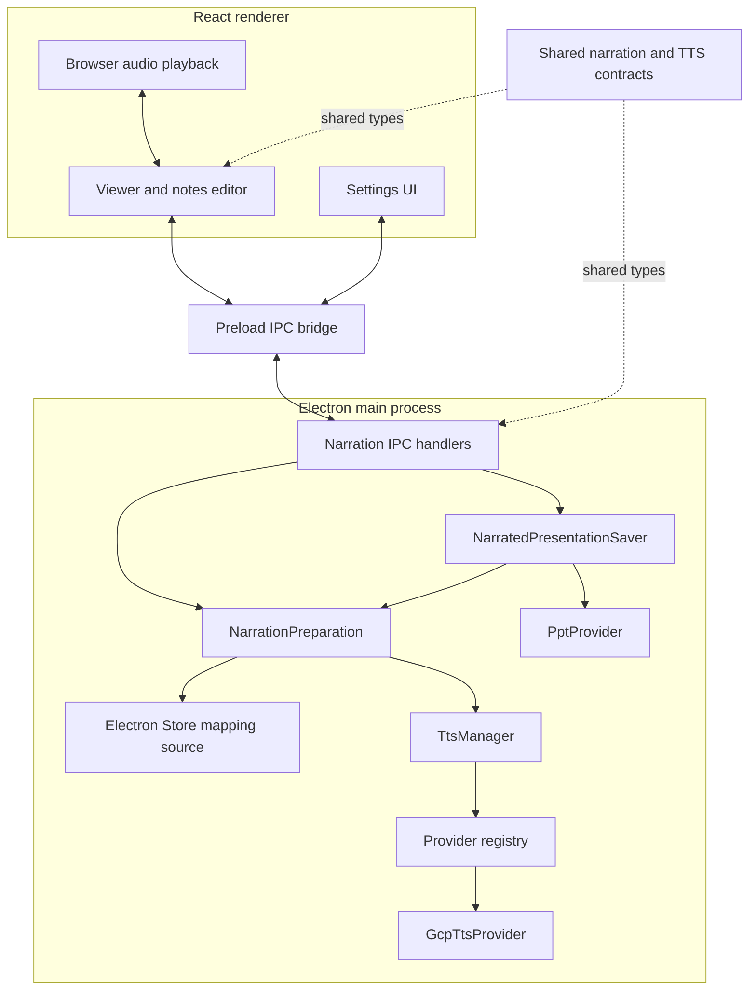
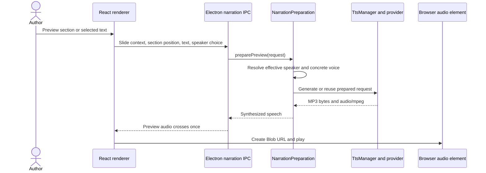
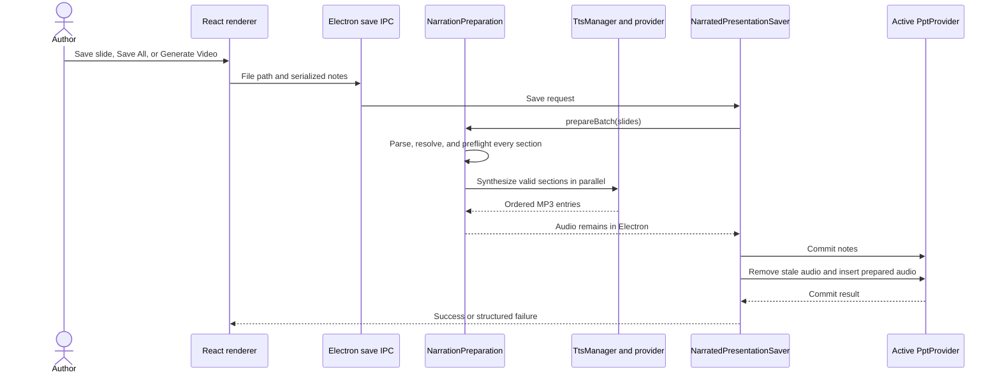

# Power Narrator

Power Narrator is a macOS Electron application for preparing spoken narration from PowerPoint
speaker notes. It lets presentation authors edit multi-speaker notes, preview the effective voice,
save notes and synthesized audio back into a `.pptx`, and export the narrated presentation as an
MP4.

Google Cloud Text-to-Speech is the only production narration provider currently shipped. Voices
retain a provider identifier and synthesis is routed through a provider registry, so another
adapter can be added without changing narration preparation.

## Features

- Load a `.pptx` and view slide images and notes side by side.
- Split notes into multiple narration sections and assign speaker aliases.
- Preview a whole section or the currently selected text with the effective speaker or a temporary
  speaker choice.
- Add supported SSML markup with the editor toolbar.
- Save one slide or the complete presentation with PowerPoint-compatible MP3 narration.
- Remove managed narration from one slide or every slide.
- Reload one slide or synchronize the whole presentation with PowerPoint.
- Export the fully prepared presentation to MP4.
- Use the experimental bundled XML CLI for direct notes and audio changes to the `.pptx` package.

## Requirements

- macOS
- A current Node.js LTS release
- pnpm
- A licensed desktop installation of Microsoft PowerPoint
- A Google Cloud service-account JSON key with access to Text-to-Speech

The production PowerPoint workflow is macOS-only. A Windows provider skeleton exists, but its
operations are not implemented.

## Quick start

```bash
git clone git@github.com:power-narrator/power-narrator-fe.git
cd power-narrator-fe
pnpm install
cp .env.example .env
pnpm run dev
```

Set `GOOGLE_APPLICATION_CREDENTIALS` in `.env` to the absolute path of a service-account JSON key,
or select the key from the application's Settings window. The environment variable takes
precedence when both are configured.

## Configure narration

1. Open **Settings** and select a Google Cloud service-account JSON key. If Settings was already
   open before choosing the key, close and reopen it to refresh the voice catalogue.
2. Choose a **Default Voice (No Tag)**. The application does not infer or migrate a default voice;
   narration that needs one fails until it is explicitly configured.
3. Add each speaker alias used by the presentation and choose a voice for it.

The voice catalogue currently contains the English (US and GB) Google Cloud Chirp 3 HD voices
returned for the configured credentials. A stored voice is concrete and provider-tagged: it keeps
the provider, voice name, supported language codes, and gender returned by the adapter. There is no
separate TTS-provider preference; each mapping's voice determines its synthesis route.

Mappings and the selected key path are persisted with Electron Store. If an older mapping refers
to an unregistered provider, it is not silently converted to Google Cloud. Replace it in Settings
before preparing narration.

### Note format and effective speakers

Put an optional speaker tag at the start of a section and separate sections with a line containing
at least three hyphens:

```text
[Narrator]
Welcome to the presentation.
---
This section inherits Narrator.
---
[Reviewer]
Here is another point of view.
```

For every non-empty section, narration preparation resolves one effective speaker:

1. An explicit non-empty speaker tag on the section wins.
2. Otherwise, the section inherits the nearest earlier explicit speaker on the same slide.
3. If the slide has no earlier explicit speaker, the configured default voice is used.

Inheritance never crosses a slide boundary. Missing defaults, incomplete mappings, unmapped
speakers, legacy placeholder voices, and unregistered provider identifiers are validation errors
with slide, section, and speaker context. Whitespace-only sections are skipped during a narrated
save.

The editor normalizes the line-ending variants PowerPoint can produce while preserving intentional
whitespace around section dividers and speaker tags during parse-and-format round trips. Its SSML
toolbar can insert breaks, `say-as`, emphasis, and paragraph tags.

## Architecture

The React renderer owns editing state, live text selection, preview playback, and deciding when a
renderer operation would discard edits. Electron owns the native discard confirmation and window
close guard, authoritative speaker mappings, narration preparation, provider calls, persistent
caching, and PowerPoint mutation. Contracts used by both processes live under `shared/`; renderer
code does not import Electron implementation modules.



### Narration preparation module

`NarrationPreparation` is the deep module behind two use cases:

- `preparePreview` plans one section from the live slide context and passes it through the shared
  array-based synthesis path.
- `prepareBatch` parses all requested slides, skips empty text, resolves every effective speaker,
  and validates every concrete voice before synthesis starts. Valid sections synthesize in
  parallel, results retain source order, and progress reports completed sections over total
  eligible sections.

Both paths trim surrounding text consistently and produce contextual validation or synthesis
errors. Preview cancellation only detaches the renderer request, preventing late playback; it does
not abort provider work that another caller may share or that can populate the cache.

`registerNarrationIpc` constructs the module from three adapters: the speaker-mapping source, the
narration synthesizer, and the active PowerPoint provider. Re-registering the handlers is the
supported injection seam used by end-to-end tests.

### Preview flow



With no selection, preview uses the complete current section. A selected range previews only that
range. The effective-speaker control follows the same resolution rules as save; choosing a named
speaker or Default explicitly is a temporary comparison and does not edit the notes. Replacing or
stopping playback revokes obsolete browser Blob URLs.

### Narrated save flow



Validation and synthesis complete before PowerPoint is changed. A preparation failure therefore
leaves PowerPoint untouched and keeps the edited notes in the Viewer session. If notes commit but
audio mutation fails, the result is reported as a partial PowerPoint failure; an ordinary retry can
reuse the synthesized cache entries. There is no automated PowerPoint rollback.

**Generate Video** first runs the same full narrated save. Video export starts only after notes and
audio commit successfully.

### Synthesis cache

`TtsManager` keeps a persistent but disposable narration cache in the operating system's
application-cache location. On macOS it is:

```text
~/Library/Caches/power-narrator/narration/
```

Each entry is a SHA-256-named `.mp3` file. The identity is a deterministic serialization of the
provider identifier and the provider's prepared request—the same normalized request used for the
actual provider call. For Google Cloud that request contains the plain-text or normalized SSML
input, concrete voice information, and MP3 output configuration. Any audio-affecting change creates
a different identity.

Simultaneous requests with the same identity share one pending provider call and publish one cache
entry. Unrelated requests remain parallel. A failed pending request is removed so the next request
can retry. Cache entries survive application restarts and have no application-managed age, count,
or size eviction. They can be deleted without losing notes, mappings, or other authored work; a
missing entry is synthesized again.

Every registered provider is expected to return PowerPoint-compatible MP3. The manager exposes
cached and newly synthesized results as `audio/mpeg`, and PowerPoint audio files use the
`ppt_audio_<section>.mp3` naming convention.

## PowerPoint providers

`PptProvider` isolates presentation operations from narration preparation:

- `MacPptProvider` uses AppleScript for PowerPoint automation and VBA macros from the bundled PPAM
  add-in for notes and audio operations.
- `XmlPptProvider` is the experimental alternate provider selected in Settings. It uses the bundled
  `electron/scripts/power-narrator-cli` executable to query and modify the PPTX package directly.
  With a native provider available, it closes and reopens the presentation around XML mutations.
  Slide image export still uses native PowerPoint automation, and video generation and slide
  playback always use the native provider.

### PowerPoint add-in

For VBA-backed notes and audio operations:

1. Open PowerPoint and choose **Tools → PowerPoint Add-ins…**.
2. Select **+** and open `electron/scripts/ppt-tools.ppam`.
3. Allow macro execution when prompted.

The source for the bundled macros is `electron/scripts/ppt-tools.bas`.

### XML CLI mode

Enable **XML CLI Engine (Experimental)** in Settings to use the bundled CLI for reading and writing
notes and managed audio. It supports notes queries and updates plus managed-audio insertion and
removal. Slide rendering and video export still require the native macOS provider.

## Project structure

```text
shared/
  narration/
    NarrationSections.ts       Note parsing, formatting, and effective speakers
    speaker.ts                 Shared default-speaker and synthesis-speaker values
  types/
    narration.d.ts             Preview, save, progress, and failure contracts
    tts.d.ts                   Provider-tagged concrete voice contract

electron/
  main.ts                      Application bootstrap and non-narration IPC
  preload.cts                  Narrow renderer-to-Electron bridge
  narration/
    NarrationPreparation.ts    Preview and batch narration preparation
    NarratedPresentationSaver.ts
                               Prepare-before-mutate narrated save workflow
    registerNarrationIpc.ts    Adapter composition and narration IPC registration
  tts/
    TtsProvider.ts             Provider and prepared-request interfaces
    TtsManager.ts              Provider registry, request identity, and disk cache
    GcpTtsProvider.ts          Google Cloud voice catalogue and MP3 synthesis
    SsmlUtil.ts                Google Cloud SSML input normalization
  platform/
    PptProvider.ts             Presentation adapter contracts
    MacPptProvider.ts          AppleScript and VBA-backed macOS adapter
    XmlPptProvider.ts          Bundled XML CLI adapter
    WindowsPptProvider.ts      Unimplemented Windows placeholder
  testing/
    narrationTestHarness.ts    Test-only adapter injection seam
  windows/                     Window creation and unsaved-narration close guard
  scripts/                     AppleScript, VBA/PPAM, and bundled XML CLI assets

src/
  components/settings/         Credentials, mappings, voices, and XML CLI settings
  components/viewer/           Slide viewer, notes editor, preview, and save UI
  context/                     Renderer settings and audio ownership

tests/
  e2e/                         Playwright Electron workflows
  fixtures/                    Local presentation fixtures
```

The important architectural patterns are a deep narration-preparation module, shared cross-process
contracts, injected external-edge adapters, a provider registry for voice routing, and an alternate
PowerPoint provider behind a common interface.

## Testing and development

The normal test suite is deterministic and does not require Google credentials, network access,
provider quota, or a running speech service.

Static analysis uses oxlint's recommended presets for ESLint, type-checked TypeScript, React and
JSX, React Hooks, Vite React Refresh, Node.js, and Vitest. The TypeScript projects use the ES2023
library definitions while retaining their existing compilation targets.

- **Unit profile** (`pnpm run test:unit`) runs Node-based tests for shared parsing and speaker rules,
  Viewer state, Electron narration preparation and saves, caching, provider request formatting, and
  PowerPoint adapters. Cross-module Electron tests use in-memory mappings and fake external edges.
- **Component profile** (`pnpm run test:component`) runs React interaction tests in headless Chromium,
  including settings, selection-aware preview, playback lifecycle, and Viewer save behavior.
- **End-to-end profile** (`pnpm run test:e2e`) builds and launches the real Electron app. With
  `NODE_ENV=test`, `powerNarratorTestHarness` replaces narration and PowerPoint edges with injected
  deterministic adapters. The fake TTS adapter returns valid fixed MP3 frames while requests still
  cross the real renderer/preload/Electron boundary.

Useful commands:

| Command                   | Purpose                                           |
| ------------------------- | ------------------------------------------------- |
| `pnpm run dev`            | Run Vite and Electron in development mode         |
| `pnpm run typecheck`      | Type-check renderer, shared, and Electron code    |
| `pnpm run lint`           | Run the configured oxlint preset suite            |
| `pnpm run format`         | Format the repository with oxfmt                  |
| `pnpm run test:unit`      | Run the Node unit/integration profile             |
| `pnpm run test:component` | Run browser component tests                       |
| `pnpm run test:e2e`       | Build and run Playwright Electron tests           |
| `pnpm run test`           | Run all three test profiles                       |
| `pnpm run build`          | Type-check and build renderer and Electron output |
| `pnpm run dist`           | Build distributable application packages          |

## Troubleshooting

### No Google Cloud voices appear

- Confirm the selected file is a valid service-account JSON key and its account can use Google
  Cloud Text-to-Speech.
- If using `.env`, make `GOOGLE_APPLICATION_CREDENTIALS` an absolute path and restart the
  development process after changing it.
- Close and reopen Settings after choosing a key so the catalogue is fetched again.
- Voice discovery failures are logged and produce an empty catalogue; they do not fall back to an
  unmapped or provider-default voice.

### Narration validation fails

The error identifies the affected slide, section, and speaker. Configure the Default Voice for an
untagged section, add the named speaker mapping, or replace an incomplete or unavailable-provider
mapping in Settings.

### PowerPoint macros fail

Confirm `electron/scripts/ppt-tools.ppam` is installed and enabled in PowerPoint, and allow macro
execution when prompted. XML CLI mode can perform supported notes and audio mutations without the
VBA macros, but slide images, playback, and video export still use native PowerPoint automation.

### macOS Gatekeeper warning

Right-click the application and choose **Open → Open**, or clear the quarantine attributes for a
trusted build:

```bash
xattr -cr "/path/to/Power Narrator.app"
```
